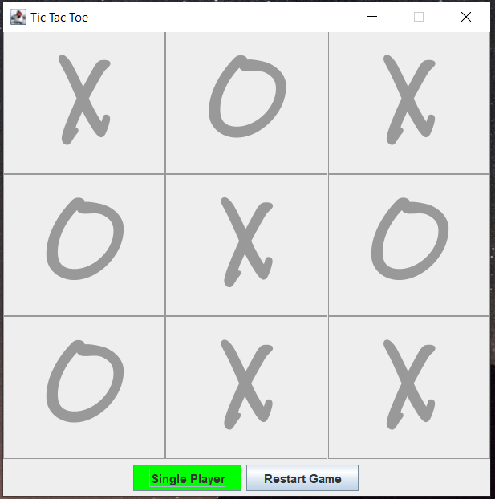

#TicTacToe using Java
This is a GUI based tic-tac-toe game.

## General Info
To play, download files and open in Java IDE of choice and run code. 

Default mode is two human players.

Select single-player before first move to play against the computer.

### Tech Stack
* Java 
* Javax Swing
* IntelliJ IDE